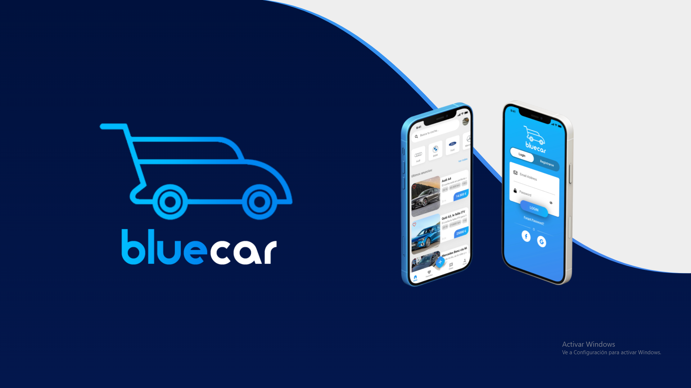

# BlueCar

App en Flutter con bd Firebase, compra y venta de coches.

## Instalar

Para Instalarlo ejecutar:
    flutter clean && flutter pub get && flutter pub run flutter_native_splash:create

A few resources to get you started if this is your first Flutter project:

- [Lab: Write your first Flutter app](https://flutter.dev/docs/get-started/codelab)
- [Cookbook: Useful Flutter samples](https://flutter.dev/docs/cookbook)

For help getting started with Flutter, view our
[online documentation](https://flutter.dev/docs), which offers tutorials,
samples, guidance on mobile development, and a full API reference.
